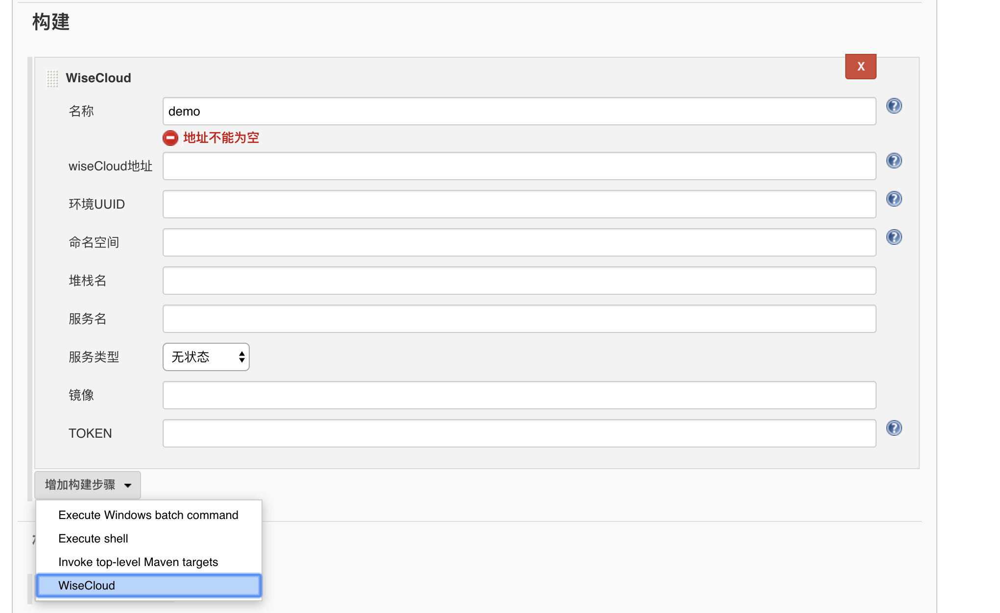

# ex-jenkins-plugin

The plugin extends Builder implements SimpleBuildStep , allows you deploy image to cloud

Requirement:
- Java8
- mave3+

## Table of Contents

- [Install](#install)
- [Start](#start)
- [Show Demo](#show-demo)
- [Develop Plugin steps](#develop-Plugin-steps)


## Install 
make sure the project can build success
````
$ cd ex-jenkins-builder-plugin 
$ mvn verify 

````

## start

```
$ mvn hpi:run 

```
If Jenkins is fully up and running ,visiting http://localhost:8080/jenkins in your browser

## Show Demo




## develop-Plugin-steps

Develop the Plugin steps and detail , at the blog : https://gitzl.github.io/2019/02/17/jenkinsPlugin/


